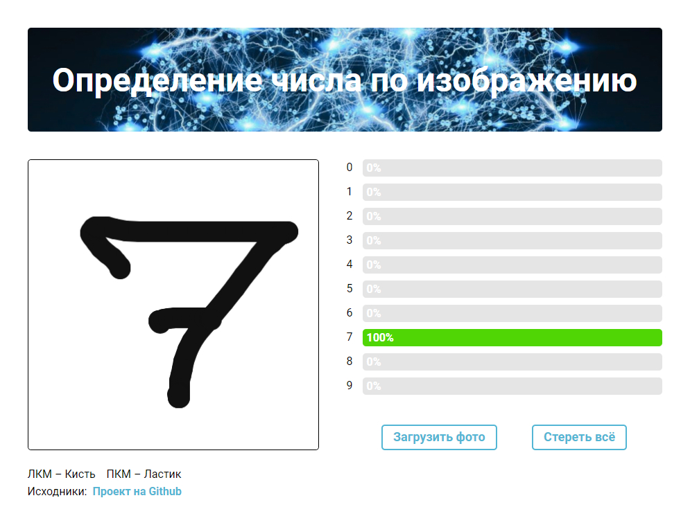
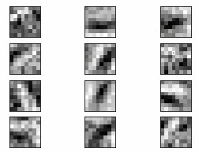
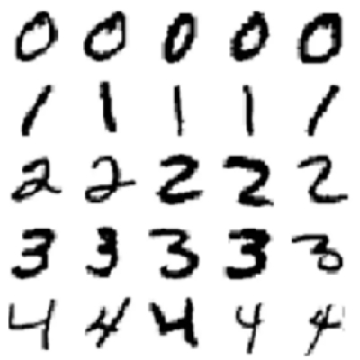
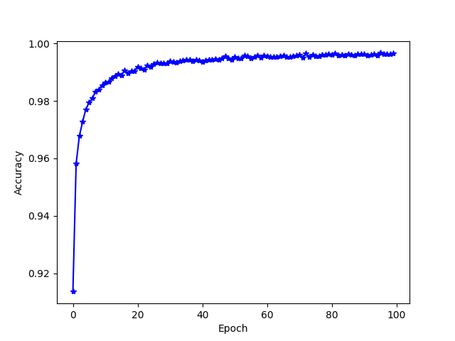

# Нейросеть по определению чисел



#### Требования

Версия Node.js - Current ([Скачать Node.js](https://nodejs.org/en/download/current/))

#### Живой пример

Смотреть: [neural.biplane-design.com](http://neural.biplane-design.com/)

#### Установка

1. Клонирование репозитория или скачивание ZIP архива:  
   `git clone https://github.com/Artemiy111/project_neural_network.git`
2. Установка зависсимостей: `npm install`

#### Запуск

```sh
npm run start
```

# Аннотация

#### Цель проекта

Создать web-приложение по определению чисел на изображениях

#### Используемые языки программирования

- JavaScript
- Python

#### Используемые библиотеки:

- [TensorFlow](https://www.tensorflow.org/) (для создания модели нейросети)
- [TensorFlow.js](https://js.tensorflow.org/api/latest/) (для конвертации нейросети в web-формат)
- [Numpy](https://numpy.org/) (для математических операций)

#### Принцип работы

Пользователь подаёт изображение, которое которое конвертируется в матрицу [28, 28] со значениями от 0 до 255, т.е. в оттенках серого. Матрица подаётся в функцию предсказания заранее обученной нейросети, которая выдаёт вероятность для каждой цифры.

Для предсказания используется свёрточная нейросеть, характеризующаяся большим количеством слоёв-масок, каждая из которых отвечает за определённые признаки изображения.



Нейросеть обучена на базе датасета [MNIST](http://yann.lecun.com/exdb/mnist/) включённого в библиотеку tensorflow.keras. Датасет представляет из себя 70000 рукописных изображений цифр.  


Обучение нейросети происходит сериями из 32 изображений в течение 100 эпох, при этом повышается точность предсказания нейросети.



Модель веса (коэффиценты функции предсказания) нейросети сохраняются и переводится в формат .json, понятный для браузера.
